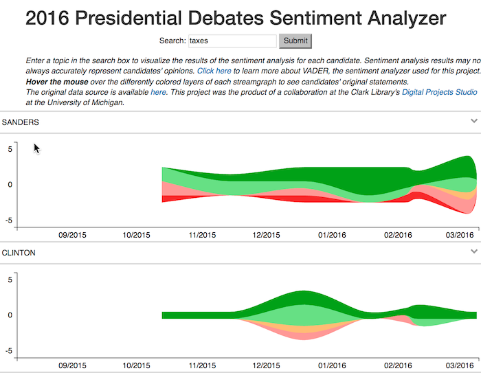

**[View the final web application](http://presidential-debates.appspot.com/)**

Opinions tend to reflect feelings as well as beliefs. Sentiment analysis, also known as opinion mining, is a technique used today for generating data on trends in people’s attitudes and feelings on anything from products and services to current events. This data is created by calculating sentiment scores using what people have said or written. Despite the efforts of computer scientists, semanticists and statisticians to figure out ways to program computers to identify the feelings expressed in words, the technique of sentiment analysis is still at best only reliable as a starting point for closer readings.

The results of sentiment analysis can quickly become misleading if presented without any reference to the actual passages of text that were analyzed. Nevertheless, it is helpful as a technique for delving into large corpora and collections of unstructured texts to capture trends and shifts in sentiment intensity.

For a final collaborative project of the academic year 2015-2016, our team at the Digital Projects Studio decided to take on the challenge of visualizing the intensity of emotions and opinions expressed during the 2016 primary election debates. Our dataset was a set of complete transcripts for twelve Republican and eight Democratic debates. To process the data, we filtered out interventions of moderators and interjections from the audience, ran the statements of each candidate through a sentiment analyzer from Python’s NLTK (Natural Language ToolKit) library, and indexed the statements of each candidate by debate number, numeric sentiment score, and sentiment category.

[Read more in the blog post "Once More, With Feeling: Draws and Drawbacks of Sentiment Analysis".](https://digitalprojectstudio.wordpress.com/2016/06/30/once-more-with-feeling-draws-and-drawbacks-of-sentiment-analysis/)

Explore the code and data directly [on the GitHub repository](https://github.com/clarkdatalabs/debate_analysis).
